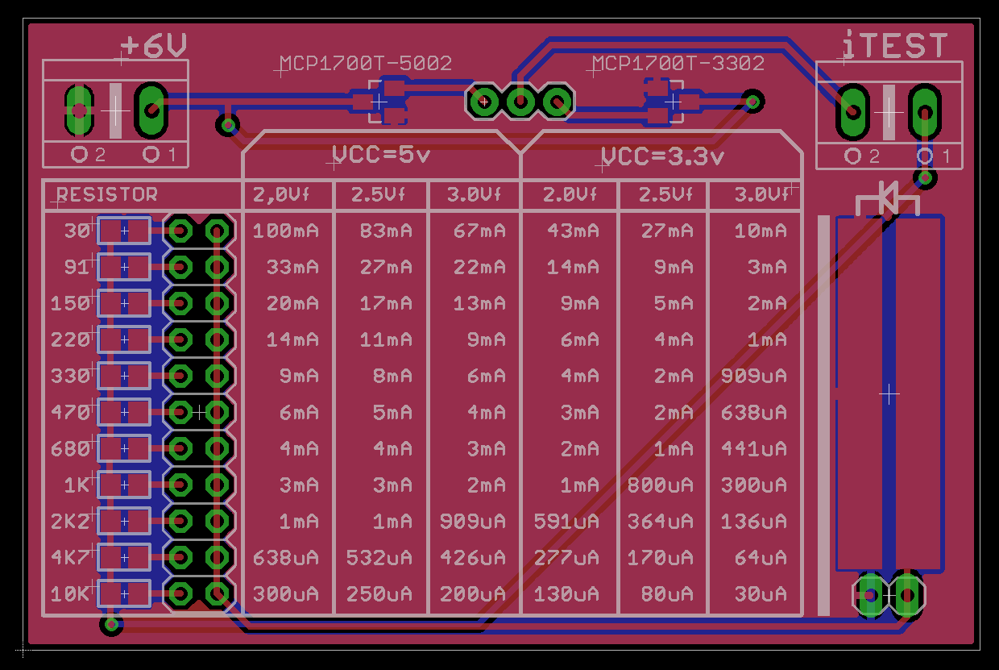

# Led tester

Device for testing brightness and current consumption of through-hole and SMD LEDs. 

## Mission

With this device you can test any bipolar LEDs and see with your eyes the real brightness and current consumption using a specific resistor value and logic voltage. That's useful because the brightness is different for each color and type of led and this device will help you to choose the right values for your project in a real environment instead of reading the datasheet.

## Features

- Powered with just 4xAA batteries or 6v-12v
- Selector for 5v and 3.3v logic with included voltage regulators
- Terminal connector for multimeter current testing (you need to short this terminals when is not used)
- Valid for SMD and through-hole leds
- Printed silkscreen table with calculated values for each resistor, supply voltage and 'Vf' of the LED
- Selector of current limiting resistor with most common values from 30Ω to 10KΩ

## Schema and board

